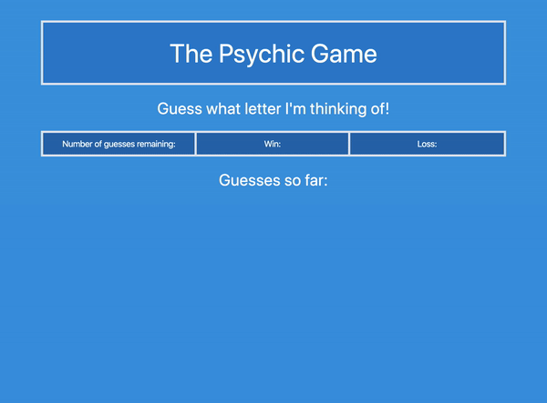

# Psychic-Game
Psychic-Game is a simple game. 

[Link to page](https://reekamaharaj.github.io/Psychic-Game/)

## Description
User against the computer, guess the letter.

## How to use
The computer picks a letter and the user has 9 tries to guess that letter. The game will start when the user presses their first key

## Tech used
- HTML
- Tailwind CSS
- Javascript
- Visual Studio

## Role in Development
Functionality and design

